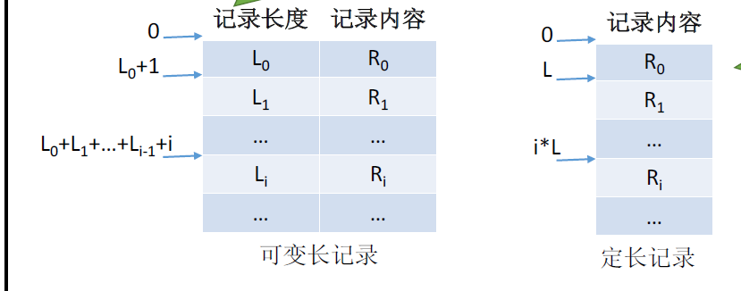
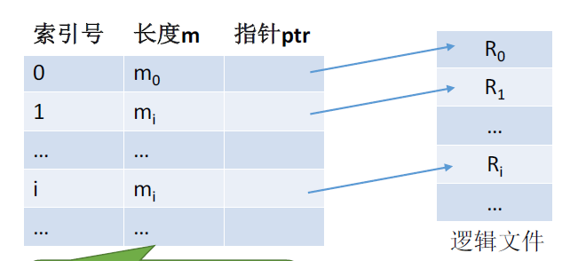
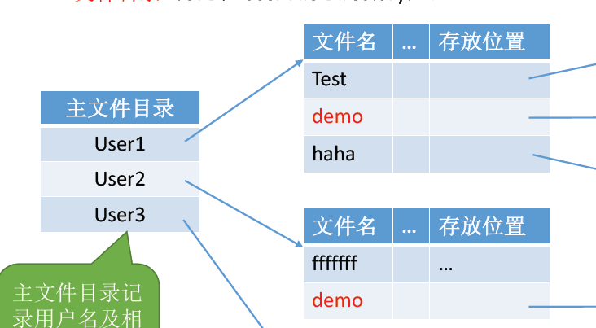
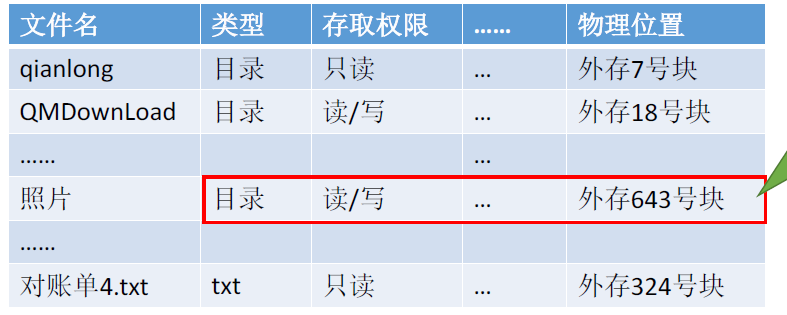
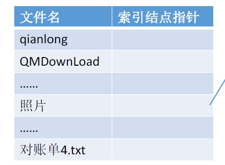
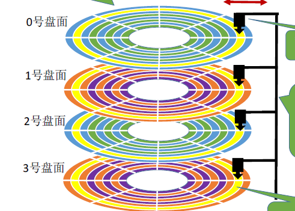
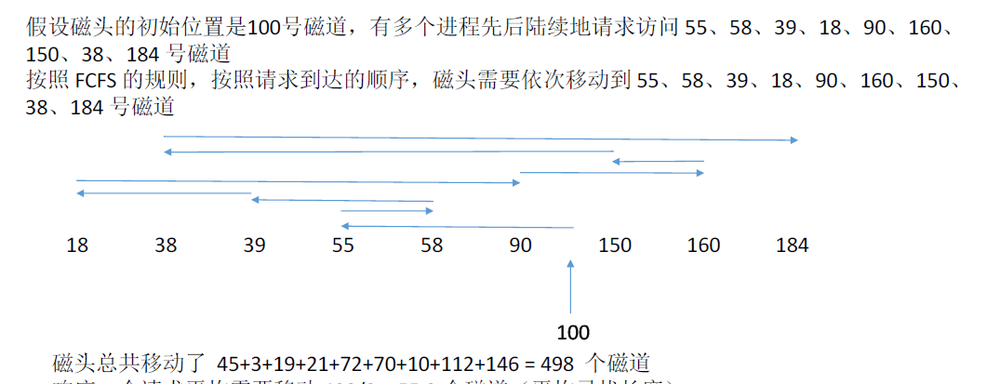
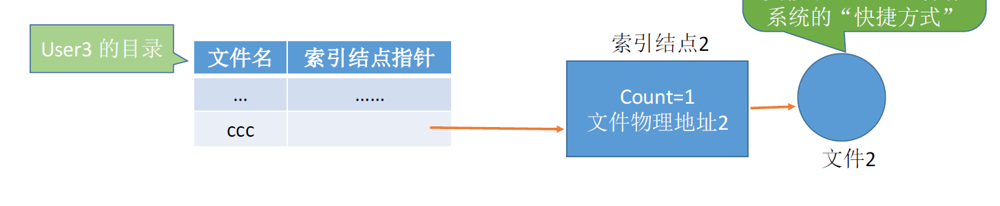
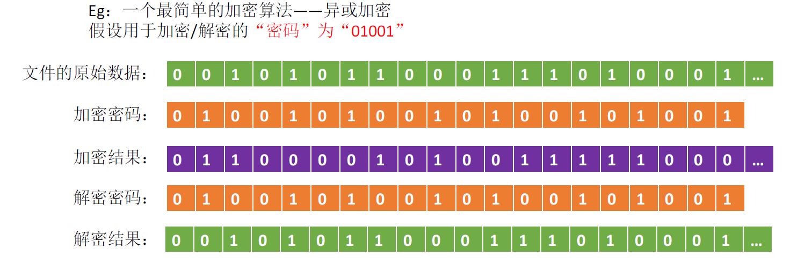
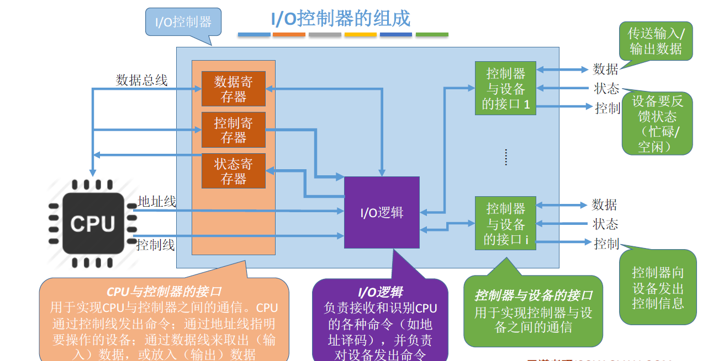

## 四、I/O原理

### 4.1 文件的逻辑结构

1. 无结构文件

文件内部数据就是一系列二进制流或字符流。最典型的就是txt文件。

2. 有结构文件

由一组相似的记录组成，又称记录式文件。典型的excel表、数据库表等。

有结构文件的逻辑结构又分`顺序文件`、`索引文件`、`索引顺序文件`

顺序文件：文件中的记录一个接一个地顺序排列（逻辑上），记录可以是定长的或可变长的。各个记录在物理上可以顺序存储或链式存储。

> 顺序存储即逻辑相邻的文件物理上也相邻，链式存储即在末尾添加新的文件。

记录的类型又分为可变长和不可变长记录：

**问题**：对于可变长记录文件，要找到第i 个记录，必须先顺序第查找前i-1 个记录，但是很多应用场景中又必须使用可变长记录。如何解决这个问题？

之后提出了索引文件:简单而言就是引入了索引表的文件。

**问题**：：每个记录对应一个索引表项，因此索引表可能会很大。比如：文件的每个记录平均只占8B，而每个索引表项占32个字节，那么索引表都要比文件内容本身大4倍，这样对存储空间的利用率就太低了。

索引顺序文件：索引顺序文件是索引文件和顺序文件思想的结合。索引顺序文件中，同样会为文件建立一张索引表，但不同的是：并不是每个记录对应一个索引表项，而是一组记录对应一个索引表项。(例如我们可以通过An Qi找到An Kang、An Jie等，而不用在索引表中存放这么多信息。另外索引项之间不需要有按照逻辑关系排列)

### 4.2 文件目录

文件目录可以分为：`单极目录结构`、`两级目录结构`、`多级目录结构(树形目录结构)`

单极目录结构：顾名思义，所有的文件放在一个目录中，类似于一个仓库把所有文件不加整理的堆放在一起，显然效率会很低下。

两级目录结构:主要分为著文件目录和用户文件目录。类似于仓库中加了几个员工货架，不同员工的货物放在不同货架，但在一个货架中文件还是采用堆砌式的存储。

多级目录结构，又称树形目录结构:我们当前主流操作系统都是多级目录结构，简而言之就是文件目录可以一级一级的延申，从而文件更有条理。

FCB(文件控制块)，首先来看一张图，如果文件目录都以这种表的形式进行信息查找，会大大降低运行效率，增加系统负担。

> 提出对策，其实在查找各级目录的过程中，只需要用到文件名这个信息，可以考虑让目录表瘦身来提升效率。

索引结点指针指向索引结点(文件名之外的其他信息就存放在结点中，从而按需读取，提升效率)

### 4.3 磁盘结构

磁道：每一圈就是一个磁道，最内侧磁道面积最小，所以数据密度最大

扇区：磁道被划分为小的磁盘块

>  一个`盘片`可能有两个`盘面`;每个盘面对应一个`磁头`；所有磁头连在一起，共进退；每个盘面的相对位置的磁道组成`柱面`

两种类型的磁盘：

### 4.4 磁盘调度算法

磁盘调度算法要解决的核心问题就是**寻道时间**，即移动磁头的时间，而其他的启动时间、传输时间都很迅速，不是最主要的时间消耗。

这里讲三种算法：

1. 先来先服务FCFS

根据进程请求房屋内磁盘的现后顺序进行调度。符合惯性思维，但在很多时候，效果很差。

2. 最短寻找时间优先(学过数据结构与算法的话，核心思想就是贪心算法)，该算法会优先处理与当前磁头最近的磁道的需求。

那么很可能磁头就会如图所示的移动，也会存在饥饿问题：磁头只在一个小区域移动，而不能满足需要远距离移动的需求。例如不断有18->38，38->18的需求，那磁头就不会执行18->150的请求，从而产生饥饿。

3. 扫描算法

核心思想，只有磁头移动到最外侧磁道的时候才能往内侧移动，移动到最内侧的时候才能向外侧移动。

这样就不会产生饥饿问题。

### 4.5 文件共享

文件共享分两种链接方式，硬链接和软连接

`硬链接`就是在另一个用户的目录中，索引结点指针直接指向了发送分享的用户的索引节点，从而实现了共享，count的数量代表文件正在被几个用户使用。

`软连接`，类似于快捷方式，记录了原文件的路径，然后层层查找。

例如文件2的内容是 C:/User1/aaa，也就是要去User1中寻找aaa的文件名对应的索引结点。

### 4.6 文件保护

文件保护有三种方式口令、加密、访问控制

1. 口令

为文件设置一串口令，就像打开手机需要先解锁。

2. 加密

使用加密方法对文件加密，只有拥有正确的解密方法才能解密，有点像不同军队之间进行通信，要实现进行加密，要是想窥探敌情，就要对密文进行破解。

3. 访问控制

每个文件的FCB或者索引结点中设置访问控制表，如windows中，设置了很多的访问权限，例如

### 4.7 I/O设备

I/O就是输入输出，I/O设备就是可以将数据输入到计算机或将计算机数据输出的设备，`常见的`：鼠标、键盘、音响、显示器、打印机、话筒、摄像头等等。

I/O控制器:CPU无法直接控制I/O设备，需要一个电子部件去充当中间人，这个部件就是I/O控制器，CPU控制I/O控制器，I/O控制器控制I/O设备。

> 假如我们的CPU能够控制I/O设备，那不同的厂商、不同型号的设备，都要对应进行编码，显然是不切实际的，所以CPU要采用通用调度方式调度I/O设备从而需要I/O控制器。

**I/O控制器的组成**

以下作为了解。

>  例如我们在Java语言中，调用System.out.Println()，这本身并不能在显示器上打印，而需要通过操作系统调用write方法，接着调用字符设备接口，命令显示器写。

