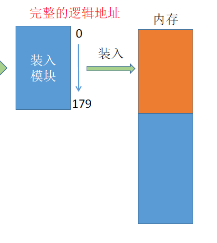
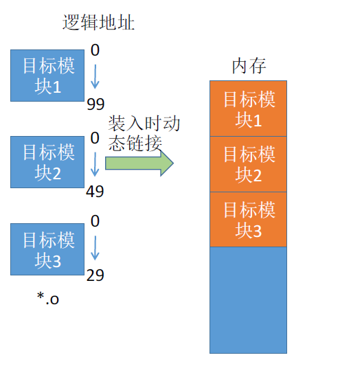
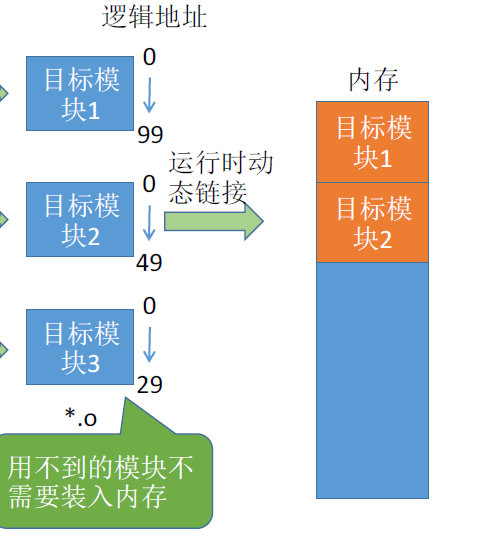
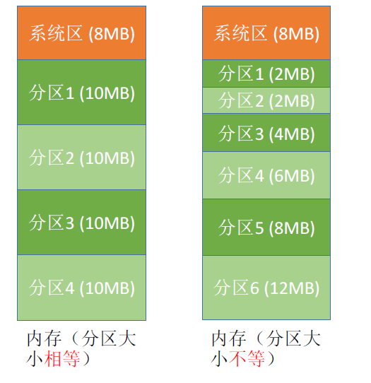
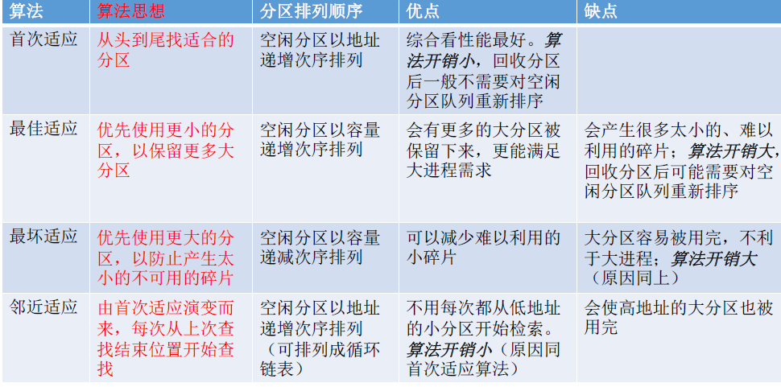
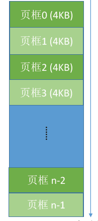
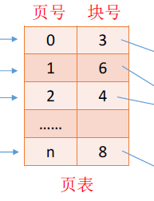
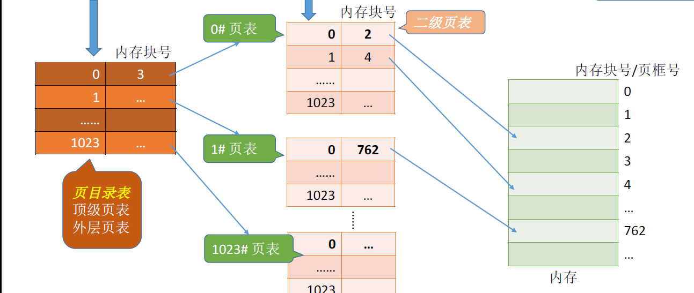

## 三、内存

内存：程序执行前要先放到内存中才能被CPU处理。计算机小白可能以为内存就是存储空间，其实不然。

地址：4G的内存空间，有4*2^30个字节，也就是2^32个字节，要表示全部的字节就需要**32位的二进制地址**，这也就是我们以前流行的32位操作系统的由来。但目前内存基本上都是8G，16G，所以32位已经不能满足需求，当前主流是**64位操作系统**，能表示2^64个字节，最高4,294,967,296G的内存空间，远远满足当前的任何个人电脑地址表达需求。

### 3.1 程序装入内存

> 可执行文件需要放在内存中才可以运行，程序中的指令是逻辑地址，而内存中的地址是物理地址。如何将逻辑地址转为物理地址？

1. 绝对装入

下图为可执行文件指令。

假如0-100的地址已经被占用，系统知道装入模块要从地址为100 的地方开始存放，编译时就将指令的绝对地址载入了可执行文件，即

2. 静态重定位

编译、链接后的装入模块的地址都是从0开始的，即可执行文件指令地址不变，在装入内存时，逻辑地址全部+100，装入内存中。所以作业一旦装入就没办法再更改、申请内存空间。

3. 动态重定位

又称动态运行时装入。编译、链接后的装入模块的地址都是从0开始的。装入程序把装入模块装入内存后，并不会立即把逻辑地址转换为物理地址，而是把地址转换推迟到**程序真正要执行时才进行**。

**这种方式需要一个重定位寄存器的支持**，寄存器记录了初始进入的的地址即100，在程序运行时，会动态的将指令中的逻辑地址增加上初始地址。

### 3.2 链接方式

1. 静态链接

>在程序运行之前，先将各目标模块及它们所需的库函数连接成一个完整的可执行文件（装入模块），之后不再拆开。

2. 装入时动态链接

> 装入时动态链接：将各目标模块装入内存时，边装入边链接的链接方式。

3. 运行时动态链接

> 在程序执行中需要该目标模块时，才对它进行链接。其优点是物理地址便于修改和更新，便于实现对目标模块的共享。

### 3.3 内存管理

操作系统需要负责内存空间的分配与回收、内存空间扩充、地址转换、内存保护。

1. **分配与回收**

分配在程序链接方式已经讲明白了，回收即对内存中的进程进行撤销、挂起等操作。

2. **扩充**

这会涉及到后面的虚拟内存技术，这也十分常见，比方说我们5G的程序如何运行在2G的内存上，这就需要扩充。

3. **地址转换**

在装入内存已经讲过。

4. **内存保护**

简单来说就是操作系统保护已经在内存上的进程不被干扰。一种方式是设置上下限寄存器存放进程上下界，如100-179被占用，其他进程不可使用这里的内存。另外一种方式是重定位寄存器与界地址寄存器，如下图

通过逻辑判断内存是否能执行某操作。

### 3.4 覆盖技术与交换技术

技术产生的原因：程序所需的运行空间大于实际内存大小，需要让内存发挥出更大的作用。

覆盖技术：按照逻辑，将不可能同时被访问的程序段共享一个覆盖区

交换技术:内存紧张时，将部分进程暂时挂起(放置到外村)，将外村已具备运行条件的进程换入内存。

### 3.5 连续分配管理方式

单一连续分配：用于早期操作系统，内存被划分为系统区和用户区，内存只能有一道用户程序，局限性不言而喻。

固定分区分配：整个用户空间划分为若干个固定大小的分区，在每个分区中只装入一道作业。

动态分区分配:不会预先划分内存分区，而是在进程装入内存时，根据进程的大小动态地建立分区。

动态分区分配会产生**外部碎片**，外部碎片，是指内存中的某些空闲分区由于太小而难以利用。

### 3.6 动态分区分配算法

- 首次适应算法

>  每次都从低地址开始查找，找到第一个能满足大小的空闲分区

- 最佳适应算法

>因此为了保证当“大进程”到来时能有连续的大片空间，可以尽可能多地留下大片的空闲区，即，优先使用更小的空闲区。

- 最坏适应算法

> 为了解决最佳适应算法的问题——即留下太多难以利用的小碎片，可以在每次分配时优先使用最大的连续空闲区，这样分配后剩余的空闲区就不会太小，更方便使用。

- 邻近适应算法

> 首次适应算法每次都从链头开始查找的。这可能会导致低地址部分出现很多小的空闲分区，而每次分配查找时，都要经过这些分区，因此也增加了查找的开销。如果每次都从上次查找结束的位置开始检索，就能解决上述问题。

**综合来看**

### 3.7 基本分页存储管理

在3.6中的算法总是存在种种问题，在实际操作系统中，分页可以解决内存分区导致的效率、碎片问题。

**图示**

页框: 每个分区就是一个“页框”（页框=页帧=内存块=物理块=物理页面）

页面:将进程的逻辑地址空间也分为与页框大小相等的一个个部分，每个部分称为一个“页”或“页面”

> 页框不能太大，否则可能产生过大的内部碎片导致浪费。

页框和页面总是记混，技巧其实很简单只要记住页面放在页框中，就再也不会记混了。

页表:操作系统要为每个进程建立一张页表。页表通常存在PCB,这里概念不清的话可能会有疑惑为什么PCB中会有页表，仔细阅读前面的部分，PCB中不光存放进程，还存放着进程信息、PID、IO情况等多个内容。

页表记录进程页面和实际存放的内存块之间的映射关系

页表项所占字节：假设某系统物理内存大小为4GB，页面大小为4KB，则有2^32 / 2^12 = 2^20 个内存块，那么每一个块号就需要20bit,至少3字节来表示。由于页号是隐含的，因此每个页表项占3B。

同样的，有进程和内存，就有地址转换的问题进程的页号是`逻辑地址`，内存的页框号是`物理地址`，中间需要计算页内偏移量。

- 页号= 逻辑地址/ 页面长度（取除法的整数部分）

- 页内偏移量= 逻辑地址% 页面长度（取除法的余数部分）

  

>  逻辑地址A 对应的物理地址= P号页面在内存中的起始地址+页内偏移量W

### 3.8 具有快表的地址变换机构

快表TLB：又称联想寄存器，是访问速度比内存快很多的高速缓存。

er

快表为什么速度快：直接从快表中取出该页对应的内存块号，再将内存块号与页内偏移量拼接形成物理地址最后，访问该物理地址对应的内存单元。因此，若快表命中，则访问某个逻辑地址仅需一次访存即可。

慢表则要在多级页表中找到对应的页表，再从相应的页号中取出内存块号。

就像看一本书，快表放了书签，而慢表则要慢慢找上次看到了哪

> 局部性原理：
>
> 时间局部性：如果执行了程序中的某条指令，那么不久后这条指令很有可能再次执行；如果某个数据被访问过，不久之后该数据很可能再次被访问。（因为程序中存在大量的循环）
> 空间局部性：一旦程序访问了某个存储单元，在不久之后，其附近的存储单元也很有可能被访问。（因为很多数据在内存中都是连续存放的）

### 3.9 两级页表

为什么要有两级页表

> 根据局部性原理，进程某个时间段内只需要访问几个页面就可以正常运行了，没必要让整个页面都在内存中常驻。同时，过大的页表还会占用很多页框，也就是内存空间。

示意图：

当整个页表被分为多个页表，在内存中只需要放入有需求的页表，从而提高效率，节省空间。

### 3.10 基本分段管理

> 分段管理：以段为单位进行分配，每个段在内存中占据连续空间，各段之间可以不相邻。大体上与分页类似，与“分页”最大的区别就是——离散分配时所分配地址空间的基本单位不同。

### 3.11 虚拟内存

在真实的操作系统中，通常采用段页式存储管理，段面向用户，页面向硬件。

虚拟内存解决的问题：

- 一次性：作业必须一次性全部装入内存后才能开始运行。这会造成两个问题：①作业很大时，不能全部装入内存，导致**大作业无法运行**；②当大量作业要求运行时，由于内存**无法容纳所有作业**，因此只有少量作业能运行，导致多道程序并发度下降。

- 驻留性：一旦作业被装入内存，就会一直驻留在内存中，直至作业运行结束。事实上，在一个时间段内，只需要访问作业的一小部分数据即可正常运行，这就导致了内存中会驻留大量的、暂时用不到的数据，**浪费了宝贵的内存资源。**

虚拟内存的实现：

- 基于局部性原理，在程序装入时，可以将程序中很快会用到的部分装入内存，暂时用不到的部分**留在外存**，就可以让程序开始执行。

- 在程序执行过程中，当所访问的信息不在内存时，由操作系统负责将所需信息从**外存调入内存**，然后继续执行程序。

- 若内存空间不够，由操作系统负责将内存中暂时用不到的信息换出到外存。在操作系统的管理下，在用户看来似乎有一个比实际内存大得多的内存，这就是**虚拟内存**。

### 3.12 请求分页管理

请求分页管理：

> 在程序执行过程中，当所访问的信息不在内存时，由操作系统负责将所需信息从外存调入内存，然后继续执行程序。若内存空间不够，由操作系统负责将内存中暂时用不到的信息换出到外存

缺页中断： 在请求分页系统中，每当要访问的页面不在内存时，便产生一个缺页中断，然后由操作系统的缺页中断处理程序处理中断。

缺页的进程阻塞，放入阻塞队列，调页完成后再将其唤醒，放回就绪队列。如果内存中有空闲块，则为进程分配一个空闲块，将所缺页面装入该块，并修改页表中相应的页表项。如果内存中没有空闲块，则由**页面置换算法**选择一个页面淘汰，同时要注意，若某个页面被换出外存，则**快表**中的相应表项也要删除，否则可能访问错误的页面

**理解缺页**，缺页就像货架上缺少了商品，需要从仓库里调取商品，就先暂停这个货架的销售，等商品调取完毕再重新出售。

### 3.13 页面置换算法

置换算法的评价指标是：缺页的次数，某种算法让缺页次数最低，调度效率最高，那就是最优的算法

1. 最佳置换算法

每次淘汰的页面都是以后永久不用或最长时间不使用的页面，保证最低的缺页率。**显然，这种需要预测未来的算法不可能实现。**

2. 先进先出算法FIFO

缺页时，淘汰最早进入的页面。算法简单，但局限性也明显，例如某些经常使用的页面一直被换进换出，和使用频率低的页面有相同的被换出的机会。

3. 最近最久未使用置换算法LRU

每次淘汰的页面都是最近最久未使用的页面。需要在页面中添加一个记录项，记录上次被访问以来经历的时间t，当需要淘汰页面时，选择时间t最大的淘汰，也就是最久未使用的淘汰。**算法设计虽好，但开销很大，实现困难。**

4. 时钟置换算法

时钟置换算法也可以称为最近未使用算法。**是一种性能和开销均衡的算法。**

简单的时钟算法实现方法:为每个页面设置一个访问位，再将内存中的页面都通过链接指针链接成一个循环队列。当某页被访问时，其访问位置为1。当需要淘汰一个页面时，只需检查页的访问位。如果是0，就选择该页换出;如果是1，则将它置为0，暂不换出，继续检查下一个页面，若第一轮扫描中所有页面都是1，则将这些页面的访问位依次置为0后，**再进行第二轮扫描**（第二轮扫描中一定会有访问位为0的页面，因此简单的CLOCK算法选择一个淘汰页面最多会经过两轮扫描)

如下图。

**了解即可**

>  问题：缺页很少，访问位都是一，那么扫描了一轮进行第二次扫描，就相当于FIFO算法，为了改进这种情况，提出了下面的算法。
>
> 改进版的时钟算法(有很多改进方式，这里只是一种)：如果把页面看成钟表，原来的慢指针相当于`时针`，现在添加一个`快指针`，相当于`分针`，分针扫描要比时针快，如果一个页面在一定时间限制内没有访问，就设访问位为0，缺页时直接换出。

