# 操作系统

### 前言

>  本篇文章的内容结合了哈工大李治军老师操作系统课程，王道考研操作系统的资料以及学习了B站CodeSheep的一次知识梳理，以及为了便于理解学习，增加了个人的一些解释。总之，对于开发人员来说，操作系统需要下四个方面进行学习：进程/线程；并发/锁；内存管理与调度；I/O原理，本文也将围绕这几点逐渐深入。

## 一、常用术语总结

| 名词                                         | 概念                                                         |
| -------------------------------------------- | :----------------------------------------------------------- |
| PCB               | 进程控制块（PCB Process Control Block）,系统中存放、管理和控制进程信息的数据结构称为 |
| TCB               | 线程控制块                                                   |
| FCB               | 文件控制块                                                   |
| PID               | 进程ID(Process ID)                                           |
| PSW               | 程序状态字寄存器，用于存放PC、IR等的信息                     |
| PC                | 程序计数器，存放下一条指令地址                               |
| IR                | 指令寄存器，存放到当前进行的指令                             |
| 半双工            | 半双工和全双工是计算机网络中的概念，意思是通讯同一时间只允许一方发送数据(对讲机) |
| 全双工            | 通信允许两方向上同时传输数据(电话)                           |
| P操作             | 来自荷兰语proveren，代表wait原语，通常使用P(S)代替wait(S)    |
| V操作             | 来自荷兰语verhogen，代表原语signal,通常使用V(S)代替signal(S) |
| 用户态            | 一般的操作系统对执行权限进行分级，分别为用保护态和内核态。用户态相较于内核态有较低的执行权限，很多操作是不被操作系统允许的，从而保证操作系统和计算机的安全。 |
| 内核态            | 内核态相当于一个介于硬件与应用之间的层，可以进行硬件的调度、使用，可以执行任何cpu指令，也可以引用任何内存地址，包括外围设备, 例如硬盘, 网卡，权限等级最高。 |
| 用户态内核态切换  | 三种情况下，用户态会转换到内核态，`系统调用、程序异常(例如/0，内存资源耗尽等)、来自外围设备的中断` |
| 系统调用/程序接口 | 用户程序通过系统调用的方式才能对硬件进行使用，或者说操作系统将使用硬件的接口提供给用户程序 |
| 中断              | 中断是操作系统内核程序夺取cpu的唯一途径，或者说用户程序调用内核代码的唯一途径，因为在一般情况下，操作系统会将cpu使用权交给应用程序。 |

## 二、进程、线程

在进程、线程这一章节除了会讲进程、线程的概念，也会穿插，并发，锁。

### 2.1 进程

  进程由PCB(进程控制块)组成,包含了PID、资源分配情况、进程运行情况。

对用户而言，我们能看到**一个个PID**，而对操作系统而言，底层需要处理的是**一个个PCB**。

下图是通过任务管理器的用户视角下的进程。

#### 2.1.1 进程控制 

进程控制相关的原语：`创建、终止、阻塞、唤醒、切换`。也就是说我们通过原语进行进程控制，原语的执行具有原子性，不允许被中断，原语的实现可以通过“关中断指令”和“开中断指令”实现。

进程状态：`运行态，就绪态，阻塞态`

下图为进程控制的流程图。

#### 2.1.2 进程的组织形式

>  在一个系统中，通常有数十、数百乃至数千个PCB。为了能对他们加以有效的管理，应该用适当的方式把这些PCB组织起来。

进程的组织形式分为两种：链接式和索引式

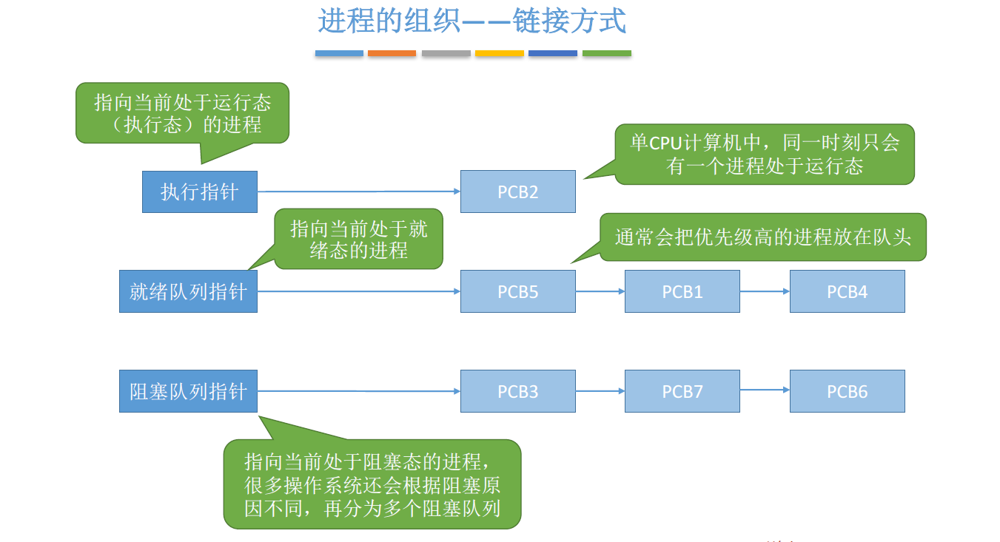

根据进程状态的不同，创建不同的索引表，可以通过指针可以通过索引表指到个PCB。

#### **2.1.3 程序的执行**

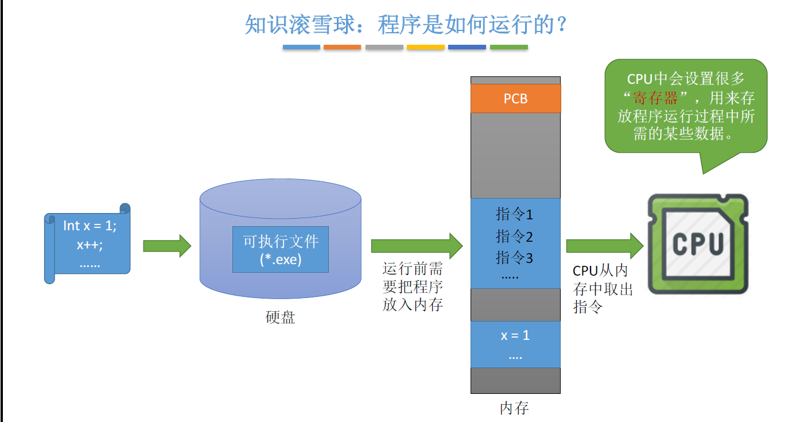

> 程序的状态字寄存器   PSW用来存放两类信息：一类是体现当前指令执行结果的各种状态信息，如有无进位（CY位），有无溢出（OV位）等；另一类是存放控制信息，如允许中断(IF位)，跟踪标志（TF位）等。

> 相较于程序，进程是动态的而程序是静态的

#### 2.1.4 进程通信

> 进程通信是指进程之间的信息交换。进程是分配系统资源的单位，因此各个进程拥有的内存地址相互独立，为了保证安全，一个进程不能直接访问另一个进程的地址空间，为了实现进程通信，操作系统提供了以下方法

进程通信方法：`共享存储、消息传递、管道通信`

**共享存储**

**消息传递**

通过原语控制，进程1发送消息到消息缓冲队列或者信箱中，进程2从消息队列或者信箱中接收消息。

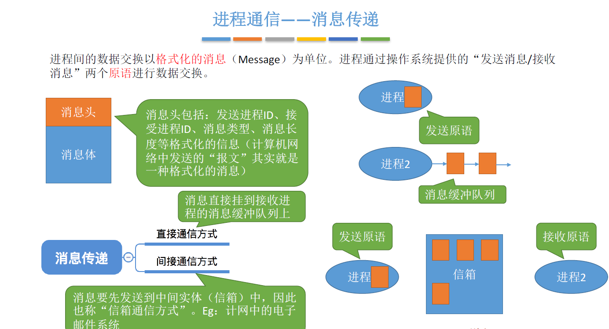

**管道通信**

### 2.2 线程

> 进程是资源分配的基本单位，线程是调度的基本单位，往往一个进程包含多个线程。线程并发，系统开销小，不需要切换系统资源。

线程可以分为用户级线程和内核级线程，早期如Unix只支持进程，不支持线程，所以当时的线程是由"线程库"实现的，用户将进程分为多个线程，放入线程库，但操作系统仍然是按照进程进行处理的。

这种用户级线程是由程序负责管理的，包括进行切换。这种切换方式**开销小，效率高**，但下图当一个用户级线程被阻塞后，整个**进程都将会被阻塞**。

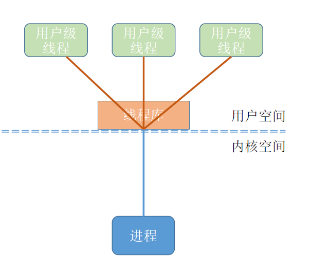

**多线程模型**

内核级线程是由操作系统完成调度的。

将n个用户级线程映射到m个内核级线程上（ n >= m），优点是克服了多对一模型并发度不高的缺点，又克服了一对一模型中一个用户进程占用太多内
核级线程，开销太大的缺点。

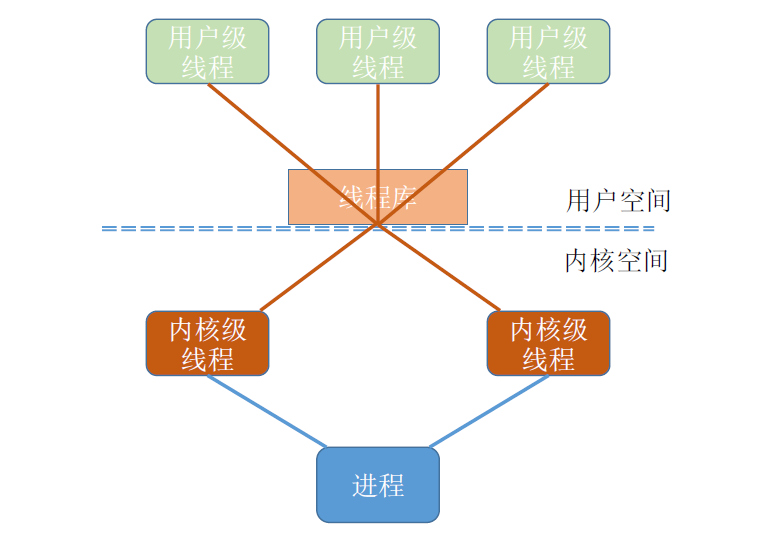

### 2.3 进程调度

#### 2.3.1 三种调度方式

> 调度的产生是因为系统资源有限，没办法同时处理所有进程，需要特定的规则分配执行顺序，从而有了调度

操作系统调度层次分为三类：高级调度、中级调度、低级调度。

高级调度：从外存的后备作业中挑选一个(多个)，建立相应的PCB，获得竞争处理的权力。

后面会讲到的虚拟内存技术出现后，为了提高系统的利用率和吞吐量，会将暂时等待的进程挂起到外存。

中级调度：能够决定哪个被挂起的进程重新回到内存中。

低级调度:从就绪队列中选取一个进程，使其能够被CPU处理。

三种调度方式的频率从低到高。

> 进程调度时机：当前运行进程主动放弃(进程中止、异常、主动请求阻塞)，被动放弃(时间片用完、更高优先级的进程进入就绪队列等)

#### 2.3.2 调度算法评价指标

>  作为开发人员的话，大致了解以下即可，毕竟工作中几乎不会涉及到具体指标计算

`CPU利用率` = 忙碌的时间/总时间

`系统吞吐量` = 总共完成了多少道作业/总共花了多少时间  (简单理解就是一个完成作业的速度指标)

`周转时间 `= 作业完成时间– 作业提交时间

`平均周转时间` = 各作业周转时间之和/作业数

`带权周转时间` = (作业完成时间– 作业提交时间)/作业实际运行的时间,这项指标一定是大于等于1的，越接近一则越好

`平均带权周转时间` = 各作业带权周转时间之和/作业数

`等待时间`，指进程/作业处于等待处理机状态时间之和

`响应时间`，指从用户提交请求到首次产生响应所用的时间。例如键盘事件响应时间，鼠标点击响应时间

#### 2.3.3 【重点】调度算法

`先来先服务FCFS`：顾名思义，先来的进程先服务，主要从“公平”的角度考虑（类似于我们生活中排队买东西的例子）,非抢占式算法。

`短作业优先SJF`：最短的作业/进程优先得到服务，追求最少的平均等待时间，非抢占式算法。

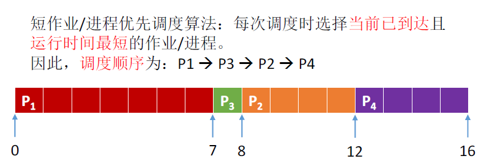

`最短剩余时间优先算法SRTN`：每当有进程加入就绪队列改变时就需要调度，如果新到达的进程剩余时间比当前运行的进程剩余时间更短，则由新进程抢占处理机，当前运行进程重新回到就绪队列。是一种抢占式算法。

> 根据图示要区分最短剩余时间优先算法和短作业优先算法。

`高响应比优先HRRN`，相应比 = （等待时间+要求服务时间）/要求服务时间

，是一种非抢占式的调度算法，只有当前运行的进程主动放弃CPU时（正常/异常完成，或主动阻塞），才需要进行调度。

以上方法适用于早期的批到处理系统，适用于交互式系统的调度算法。

适用于目前交互式系统的调度算法，在交互式操作系统中，可以将任务划分为前台任务(鼠标、键盘等任务)和后台任务，前台任务更关心响应事件，后台任务更关心周转。

`时间片轮转调度算法RR`：周期性切换PCB，各个PCB轮流使用CPU

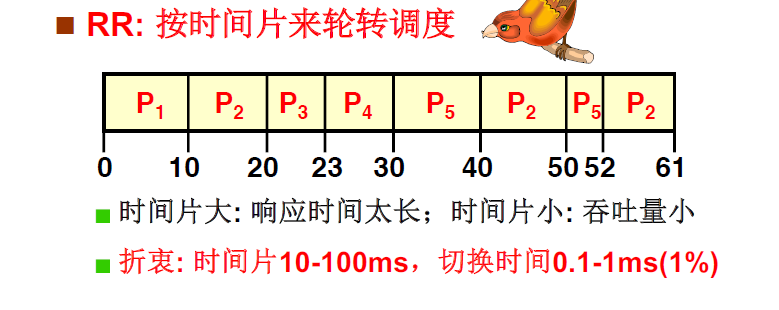

`最高优先级调度算法`即前台进程优先级高于后台进程，系统进程优先级会高于用户进程，特点就是不公平，容易产生饥饿。

>1973年关闭的MIT的IBM 7094时，发现有一个进程在1967年提交但一直未运行

### 2.4 实现进程互斥、同步、前驱

如果要清晰讲述需要了解代码逻辑，对于非专业人员来说，必要性不大，这里就不详细罗列代码了。

#### 2.4.1 硬件实现进程互斥

进程互斥：当一个进程进入临界区后，另一个进程必须等待。

硬件能够实现进程互斥，有三种方式：**利用“开/关中断指令”实现**、**TSL指令**、**SWAP指令**。

#### 2.4.2 信号量机制实现互斥、同步、前驱

信号量机制：用户进程可以通过使用操作系统提供的原语对信号量进行操作，从而很方便的实现进程的互斥、同步、前驱。

>  不要一头钻到代码里，要注意理解信号量背后的含义，一个信号量对应一种资源
> 信，在操作系统中，信号量在源码中其实就对应着一个变量，代表着某种资源的数量，通过信号量可以实现进程互斥、同步、前驱。

进程同步的理解：`要让各并发进程按要求有序地推进`。若PCB2 的“代码4”要基于PCB1 的“代码1”和“代码2”的运行结果才能执行，那么我们就必须保证“代码4”一定是在“代码2”之后才会执行。

前驱的理解：其实每一对前驱关系都是一个进程同步问题（需要保证一前一后的操作）

信号量保护：共享数据在没有保护的情况下，会出现安全问题，所以需要锁来进行保护，锁本质也是一个变量，用来保护信号量安全，那锁本身的安全谁来保护？我们不能在这里套娃对不对，所以锁是一种硬件原子指令，当要进入临界区时，上锁，离开临界区时解锁。下面的知识有一些扩展了。

> 在cpu芯片上有一个HLOCK Pin，可以通过发送指令来操作，将#HLOCK Pin电位拉低，并持续到这条指令执行完毕，从而将总线锁住，这样同一总线上的其他CPU就不能通过总线来访问内存了。最开始这些功能是用来测试cpu的，后来被操作系统实现而封装成各种功能：关键代码段，信号量等。
>
> 作者：tracy_668
> 链接：https://www.jianshu.com/p/61490effab35
> 来源：简书

### 2.5 死锁的概念与处理

`死锁的4个条件`，缺一不可

- 互斥条件：对必须互斥使用的资源的争抢才会导致死锁
- 不剥夺条件：进程所获得的资源未使用完之前，不能被其他进程强行夺走，只能主动释放。
- 请求和保持条件：进程已经保持了至少一个资源，但又提出了新的资源请求，而该资源又被其他进程占有，此时请求进程被阻塞，但又对自己有的资源保持不放。就像很窄的桥，两个人都要去对面，但谁又都无法让出位置来

- 循环等待条件：存在一种进程资源的循环等待，链中的每一个进程已获得的资源同时被下一个进程所请求。想象有一个闭环，闭环上每个人都需要下一个人手上的某个资源，那么所有人都没办法满足

  

  下图就像我们的一个死锁

  

`死锁的处理方式`：

- 死锁预防

  - 破坏互斥条件(创建一个队列，所有的请求都会被快速响应，然后队列逐渐将请求发送到处理器进行整理)

  - 破坏不剥夺条件(进程的某个资源得不到满足时，就必须立刻释放所持有的资源)

  - 破坏请求和保持条件(静态分配，进程在运行前就一次性申请全部的资源，不满足就不让允许，就像过桥时保证桥上没人才让通行，否则禁止通行)

  - 破坏循环等待条件(资源编号，进程必须按照编号递增的顺序请求资源,这样就不会出现持有大资源请求小资源的情况，也就不会有循环的等待)

    (方式较多，这里简单列举一些案例)

- 死锁避免

> 银行家算法：进程提出资源申请时，先判断这次分配会不会导致系统进入不安全状态，如果会则不答应请求，让该进程阻塞。简而言之，请求不能大于手中的资源。这种算法也叫银行家算法。

- 死锁检测与恢复

  检测方法通过死锁检测算法，下面以图的方式说明

  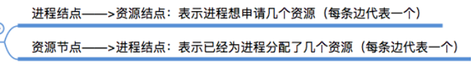

  能够消除所有边，就不会发生死锁如下图

  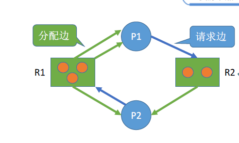

  不能消除所有边就会发生死锁

  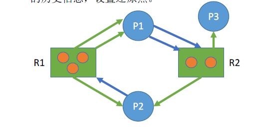

  **死锁恢复：**资源剥夺将死锁的进程挂起，释放资源；撤销进程，直接将部分或者全部死锁进程撤销；进程回退，让进程回退的足以避免死锁的地方。

- 死锁忽略

  顾名思义，忽略这个死锁，死锁概率本不高，就算出现了也只是局部的死锁，直接不管反而能提高资源利用率与整体运行的速度，也有个好听的名字叫鸵鸟算法，这样性能会提升不少，大部分操作系统也采用死锁忽略的策略。

## 三、内存

内存：程序执行前要先放到内存中才能被CPU处理。计算机小白可能以为内存就是存储空间，其实不然。

地址：4G的内存空间，有4*2^30个字节，也就是2^32个字节，要表示全部的字节就需要**32位的二进制地址**，这也就是我们以前流行的32位操作系统的由来。但目前内存基本上都是8G，16G，所以32位已经不能满足需求，当前主流是**64位操作系统**，能表示2^64个字节，最高4,294,967,296G的内存空间，远远满足当前的任何个人电脑地址表达需求。

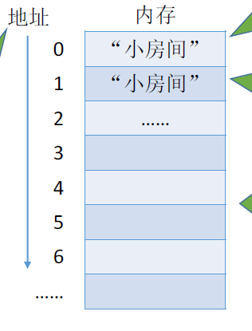

### 3.1 程序装入内存

> 可执行文件需要放在内存中才可以运行，程序中的指令是逻辑地址，而内存中的地址是物理地址。如何将逻辑地址转为物理地址？

1. 绝对装入

下图为可执行文件指令。

假如0-100的地址已经被占用，系统知道装入模块要从地址为100 的地方开始存放，编译时就将指令的绝对地址载入了可执行文件，即

2. 静态重定位

编译、链接后的装入模块的地址都是从0开始的，即可执行文件指令地址不变，在装入内存时，逻辑地址全部+100，装入内存中。所以作业一旦装入就没办法再更改、申请内存空间。

3. 动态重定位

又称动态运行时装入。编译、链接后的装入模块的地址都是从0开始的。装入程序把装入模块装入内存后，并不会立即把逻辑地址转换为物理地址，而是把地址转换推迟到**程序真正要执行时才进行**。

**这种方式需要一个重定位寄存器的支持**，寄存器记录了初始进入的的地址即100，在程序运行时，会动态的将指令中的逻辑地址增加上初始地址。

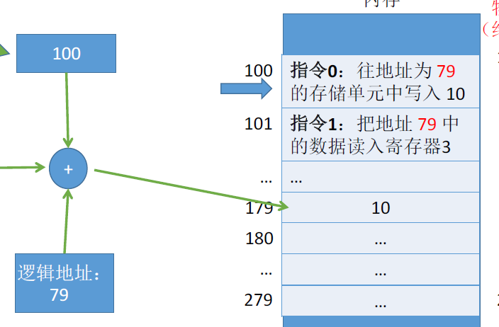

### 3.2 链接方式

1. 静态链接

>在程序运行之前，先将各目标模块及它们所需的库函数连接成一个完整的可执行文件（装入模块），之后不再拆开。

2. 装入时动态链接

> 装入时动态链接：将各目标模块装入内存时，边装入边链接的链接方式。

3. 运行时动态链接

> 在程序执行中需要该目标模块时，才对它进行链接。其优点是物理地址便于修改和更新，便于实现对目标模块的共享。

### 3.3 内存管理

操作系统需要负责内存空间的分配与回收、内存空间扩充、地址转换、内存保护。

1. **分配与回收**

分配在程序链接方式已经讲明白了，回收即对内存中的进程进行撤销、挂起等操作。

2. **扩充**

这会涉及到后面的虚拟内存技术，这也十分常见，比方说我们5G的程序如何运行在2G的内存上，这就需要扩充。

3. **地址转换**

在装入内存已经讲过。

4. **内存保护**

简单来说就是操作系统保护已经在内存上的进程不被干扰。一种方式是设置上下限寄存器存放进程上下界，如100-179被占用，其他进程不可使用这里的内存。另外一种方式是重定位寄存器与界地址寄存器，如下图

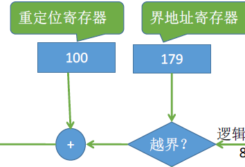

通过逻辑判断内存是否能执行某操作。

### 3.4 覆盖技术与交换技术

技术产生的原因：程序所需的运行空间大于实际内存大小，需要让内存发挥出更大的作用。

覆盖技术：按照逻辑，将不可能同时被访问的程序段共享一个覆盖区

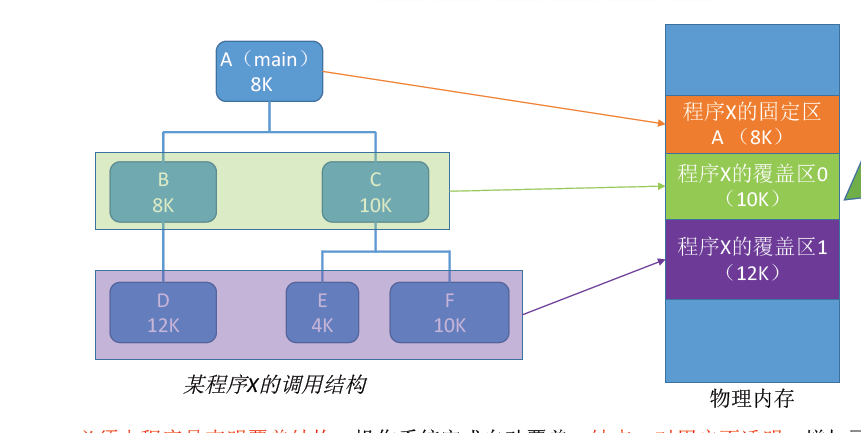

交换技术:内存紧张时，将部分进程暂时挂起(放置到外村)，将外村已具备运行条件的进程换入内存。

### 3.5 连续分配管理方式

单一连续分配：用于早期操作系统，内存被划分为系统区和用户区，内存只能有一道用户程序，局限性不言而喻。

固定分区分配：整个用户空间划分为若干个固定大小的分区，在每个分区中只装入一道作业。

动态分区分配:不会预先划分内存分区，而是在进程装入内存时，根据进程的大小动态地建立分区。

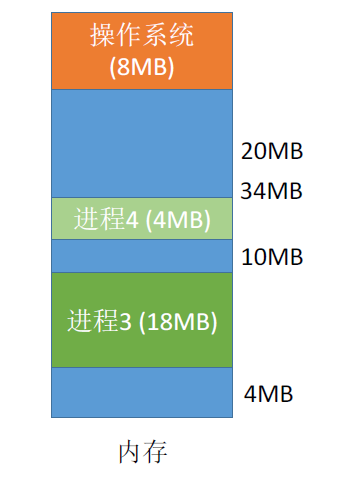

动态分区分配会产生**外部碎片**，外部碎片，是指内存中的某些空闲分区由于太小而难以利用。

### 3.6 动态分区分配算法

- 首次适应算法

>  每次都从低地址开始查找，找到第一个能满足大小的空闲分区

- 最佳适应算法

>因此为了保证当“大进程”到来时能有连续的大片空间，可以尽可能多地留下大片的空闲区，即，优先使用更小的空闲区。

- 最坏适应算法

> 为了解决最佳适应算法的问题——即留下太多难以利用的小碎片，可以在每次分配时优先使用最大的连续空闲区，这样分配后剩余的空闲区就不会太小，更方便使用。

- 邻近适应算法

> 首次适应算法每次都从链头开始查找的。这可能会导致低地址部分出现很多小的空闲分区，而每次分配查找时，都要经过这些分区，因此也增加了查找的开销。如果每次都从上次查找结束的位置开始检索，就能解决上述问题。

**综合来看**

### 3.7 基本分页存储管理

在3.6中的算法总是存在种种问题，在实际操作系统中，分页可以解决内存分区导致的效率、碎片问题。

**图示**

页框: 每个分区就是一个“页框”（页框=页帧=内存块=物理块=物理页面）

页面:将进程的逻辑地址空间也分为与页框大小相等的一个个部分，每个部分称为一个“页”或“页面”

> 页框不能太大，否则可能产生过大的内部碎片导致浪费。

页框和页面总是记混，技巧其实很简单只要记住页面放在页框中，就再也不会记混了。

页表:操作系统要为每个进程建立一张页表。页表通常存在PCB,这里概念不清的话可能会有疑惑为什么PCB中会有页表，仔细阅读前面的部分，PCB中不光存放进程，还存放着进程信息、PID、IO情况等多个内容。

页表记录进程页面和实际存放的内存块之间的映射关系

页表项所占字节：假设某系统物理内存大小为4GB，页面大小为4KB，则有2^32 / 2^12 = 2^20 个内存块，那么每一个块号就需要20bit,至少3字节来表示。由于页号是隐含的，因此每个页表项占3B。

同样的，有进程和内存，就有地址转换的问题进程的页号是`逻辑地址`，内存的页框号是`物理地址`，中间需要计算页内偏移量。

- 页号= 逻辑地址/ 页面长度（取除法的整数部分）

- 页内偏移量= 逻辑地址% 页面长度（取除法的余数部分）

  

>  逻辑地址A 对应的物理地址= P号页面在内存中的起始地址+页内偏移量W

### 3.8 具有快表的地址变换机构

快表TLB：又称联想寄存器，是访问速度比内存快很多的高速缓存。

er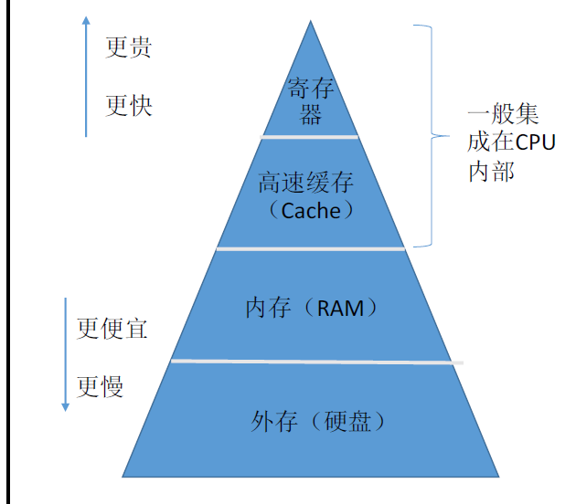

快表为什么速度快：直接从快表中取出该页对应的内存块号，再将内存块号与页内偏移量拼接形成物理地址最后，访问该物理地址对应的内存单元。因此，若快表命中，则访问某个逻辑地址仅需一次访存即可。

慢表则要在多级页表中找到对应的页表，再从相应的页号中取出内存块号。

就像看一本书，快表放了书签，而慢表则要慢慢找上次看到了哪

> 局部性原理：
>
> 时间局部性：如果执行了程序中的某条指令，那么不久后这条指令很有可能再次执行；如果某个数据被访问过，不久之后该数据很可能再次被访问。（因为程序中存在大量的循环）
> 空间局部性：一旦程序访问了某个存储单元，在不久之后，其附近的存储单元也很有可能被访问。（因为很多数据在内存中都是连续存放的）

### 3.9 两级页表

为什么要有两级页表

> 根据局部性原理，进程某个时间段内只需要访问几个页面就可以正常运行了，没必要让整个页面都在内存中常驻。同时，过大的页表还会占用很多页框，也就是内存空间。

示意图：

当整个页表被分为多个页表，在内存中只需要放入有需求的页表，从而提高效率，节省空间。

### 3.10 基本分段管理

> 分段管理：以段为单位进行分配，每个段在内存中占据连续空间，各段之间可以不相邻。大体上与分页类似，与“分页”最大的区别就是——离散分配时所分配地址空间的基本单位不同。

### 3.11 虚拟内存

在真实的操作系统中，通常采用段页式存储管理，段面向用户，页面向硬件。

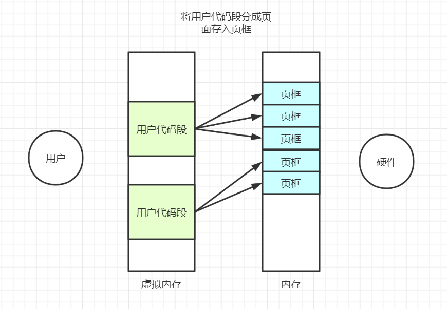

虚拟内存解决的问题：

- 一次性：作业必须一次性全部装入内存后才能开始运行。这会造成两个问题：①作业很大时，不能全部装入内存，导致**大作业无法运行**；②当大量作业要求运行时，由于内存**无法容纳所有作业**，因此只有少量作业能运行，导致多道程序并发度下降。

- 驻留性：一旦作业被装入内存，就会一直驻留在内存中，直至作业运行结束。事实上，在一个时间段内，只需要访问作业的一小部分数据即可正常运行，这就导致了内存中会驻留大量的、暂时用不到的数据，**浪费了宝贵的内存资源。**

虚拟内存的实现：

- 基于局部性原理，在程序装入时，可以将程序中很快会用到的部分装入内存，暂时用不到的部分**留在外存**，就可以让程序开始执行。

- 在程序执行过程中，当所访问的信息不在内存时，由操作系统负责将所需信息从**外存调入内存**，然后继续执行程序。

- 若内存空间不够，由操作系统负责将内存中暂时用不到的信息换出到外存。在操作系统的管理下，在用户看来似乎有一个比实际内存大得多的内存，这就是**虚拟内存**。

### 3.12 请求分页管理

请求分页管理：

> 在程序执行过程中，当所访问的信息不在内存时，由操作系统负责将所需信息从外存调入内存，然后继续执行程序。若内存空间不够，由操作系统负责将内存中暂时用不到的信息换出到外存

缺页中断： 在请求分页系统中，每当要访问的页面不在内存时，便产生一个缺页中断，然后由操作系统的缺页中断处理程序处理中断。

缺页的进程阻塞，放入阻塞队列，调页完成后再将其唤醒，放回就绪队列。如果内存中有空闲块，则为进程分配一个空闲块，将所缺页面装入该块，并修改页表中相应的页表项。如果内存中没有空闲块，则由**页面置换算法**选择一个页面淘汰，同时要注意，若某个页面被换出外存，则**快表**中的相应表项也要删除，否则可能访问错误的页面

**理解缺页**，缺页就像货架上缺少了商品，需要从仓库里调取商品，就先暂停这个货架的销售，等商品调取完毕再重新出售。

### 3.13 页面置换算法

置换算法的评价指标是：缺页的次数，某种算法让缺页次数最低，调度效率最高，那就是最优的算法

1. 最佳置换算法

每次淘汰的页面都是以后永久不用或最长时间不使用的页面，保证最低的缺页率。**显然，这种需要预测未来的算法不可能实现。**

2. 先进先出算法FIFO

缺页时，淘汰最早进入的页面。算法简单，但局限性也明显，例如某些经常使用的页面一直被换进换出，和使用频率低的页面有相同的被换出的机会。

3. 最近最久未使用置换算法LRU

每次淘汰的页面都是最近最久未使用的页面。需要在页面中添加一个记录项，记录上次被访问以来经历的时间t，当需要淘汰页面时，选择时间t最大的淘汰，也就是最久未使用的淘汰。**算法设计虽好，但开销很大，实现困难。**

4. 时钟置换算法

时钟置换算法也可以称为最近未使用算法。**是一种性能和开销均衡的算法。**

简单的时钟算法实现方法:为每个页面设置一个访问位，再将内存中的页面都通过链接指针链接成一个循环队列。当某页被访问时，其访问位置为1。当需要淘汰一个页面时，只需检查页的访问位。如果是0，就选择该页换出;如果是1，则将它置为0，暂不换出，继续检查下一个页面，若第一轮扫描中所有页面都是1，则将这些页面的访问位依次置为0后，**再进行第二轮扫描**（第二轮扫描中一定会有访问位为0的页面，因此简单的CLOCK算法选择一个淘汰页面最多会经过两轮扫描)

如下图。

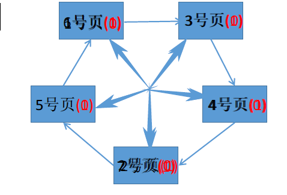

**了解即可**

>  问题：缺页很少，访问位都是一，那么扫描了一轮进行第二次扫描，就相当于FIFO算法，为了改进这种情况，提出了下面的算法。
>
> 改进版的时钟算法(有很多改进方式，这里只是一种)：如果把页面看成钟表，原来的慢指针相当于`时针`，现在添加一个`快指针`，相当于`分针`，分针扫描要比时针快，如果一个页面在一定时间限制内没有访问，就设访问位为0，缺页时直接换出。

## 四、I/O原理

> 注意文件索引和文件目录结构的区别，索引是检索文件的方式，而文件目录结构是用户管理计算机文件的一种结构，单级目录、多级目录等等。在用户目录的基础上，文件控制块FCB会指向对应的索引块。

### 4.1 文件的逻辑结构

1. 无结构文件

文件内部数据就是一系列二进制流或字符流。最典型的就是txt文件。

2. 有结构文件

由一组相似的记录组成，又称记录式文件。典型的excel表、数据库表等。

有结构文件的逻辑结构又分`顺序文件`、`索引文件`、`索引顺序文件`

顺序文件：文件中的记录一个接一个地顺序排列（逻辑上），记录可以是定长的或可变长的。各个记录在物理上可以顺序存储或链式存储。

> 顺序存储即逻辑相邻的文件物理上也相邻，链式存储即在末尾添加新的文件。

记录的类型又分为可变长和不可变长记录：

**问题**：对于可变长记录文件，要找到第i 个记录，必须先顺序第查找前 i - 1 个记录，但是很多应用场景中又必须使用可变长记录。如何解决这个问题？

之后提出了索引文件:简单而言就是引入了索引表的文件。索引表本身是顺序文件，即索引表顺序存储在一起。

**问题**：：每个记录对应一个索引表项，因此索引表可能会很大。比如：文件的每个记录平均只占8B，而每个索引表项占32个字节，那么索引表都要比文件内容本身大4倍，这样对存储空间的利用率就太低了。

索引顺序文件：索引顺序文件是索引文件和顺序文件思想的结合。索引顺序文件中，同样会为文件建立一张索引表，但不同的是：并不是每个记录对应一个索引表项，而是一组记录对应一个索引表项，索引表项的地址直接指向顺序文件所在区域，再顺序查找到所需的文件，从而节省了很大的空间。(例如我们可以通过An Qi找到An Kang、An Jie等，而不用在索引表中存放这么多信息。另外索引项之间不需要有按照逻辑关系排列)

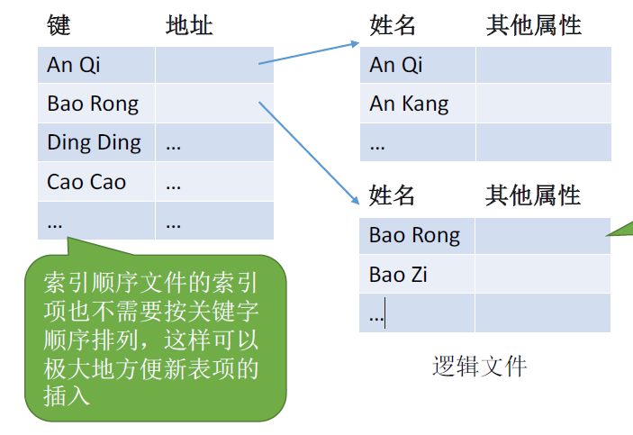

多级索引顺序文件：在索引顺序文件的基础上再增加层次深度，可以减少查找的次数(顺序查找范围缩小了)

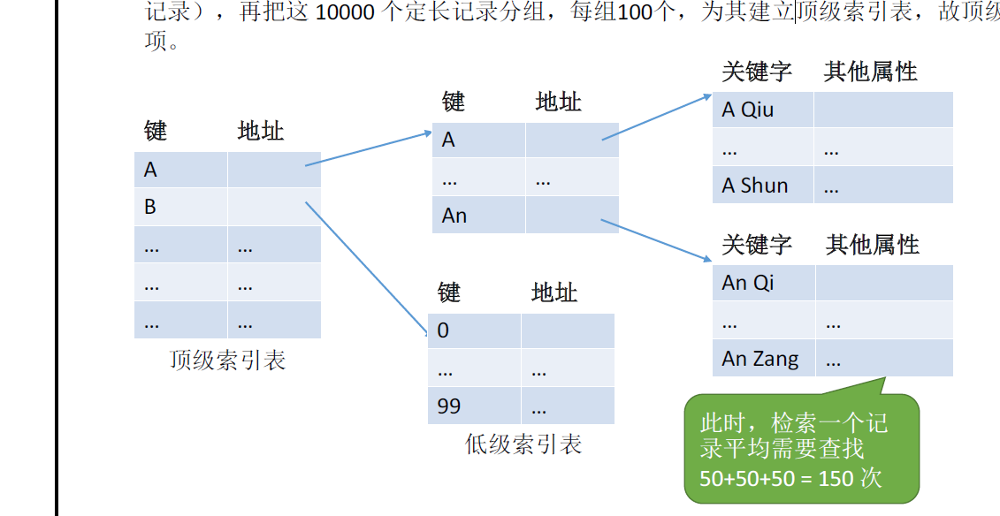

### 4.2 文件目录

文件目录可以分为：`单级目录结构`、`两级目录结构`、`多级目录结构(树形目录结构)`

单极目录结构：顾名思义，所有的文件放在一个目录中，类似于一个仓库把所有文件不加整理的堆放在一起，显然效率会很低下。

两级目录结构:主要分为主文件目录和用户文件目录。类似于仓库中加了几个员工货架，不同员工的货物放在不同货架，但在一个货架中文件还是采用堆砌式的存储。

多级目录结构，又称树形目录结构:我们当前主流操作系统都是多级目录结构，简而言之就是文件目录可以一级一级的延申，从而文件更有条理。

FCB(文件控制块)，首先来看一张图，如果文件目录都以这种表的形式进行信息查找，会大大降低运行效率，增加系统负担。

> 提出对策，其实在查找各级目录的过程中，只需要用到文件名这个信息，可以考虑让目录表瘦身来提升效率。

索引结点指针指向索引结点(文件名之外的其他信息就存放在结点中，从而按需读取，提升效率)

### 4.3 磁盘结构

磁道：每一圈就是一个磁道，最内侧磁道面积最小，所以数据密度最大

扇区：磁道被划分为小的磁盘块

>  一个`盘片`可能有两个`盘面`;每个盘面对应一个`磁头`；所有磁头连在一起，共进退；每个盘面的相对位置的磁道组成`柱面`

两种类型的磁盘：

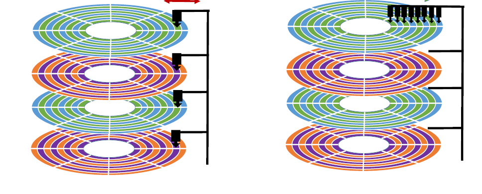

### 4.4 磁盘调度算法

磁盘调度算法要解决的核心问题就是**寻道时间**，即移动磁头的时间，而其他的启动时间、传输时间都很迅速，不是最主要的时间消耗。

这里讲三种算法：

1. 先来先服务FCFS

根据进程请求房屋内磁盘的现后顺序进行调度。符合惯性思维，但在很多时候，效果很差。

2. 最短寻找时间优先(学过数据结构与算法的话，核心思想就是贪心算法)，该算法会优先处理与当前磁头最近的磁道的需求。

那么很可能磁头就会如图所示的移动，也会存在饥饿问题：磁头只在一个小区域移动，而不能满足需要远距离移动的需求。例如不断有18->38，38->18的需求，那磁头就不会执行18->150的请求，从而产生饥饿。

3. 扫描算法

核心思想，只有磁头移动到最外侧磁道的时候才能往内侧移动，移动到最内侧的时候才能向外侧移动。

这样就不会产生饥饿问题。

### 4.5 文件共享

文件共享分两种链接方式，硬链接和软连接

`硬链接`就是在另一个用户的目录中，索引结点指针直接指向了发送分享的用户的索引节点，从而实现了共享，count的数量代表文件正在被几个用户使用。

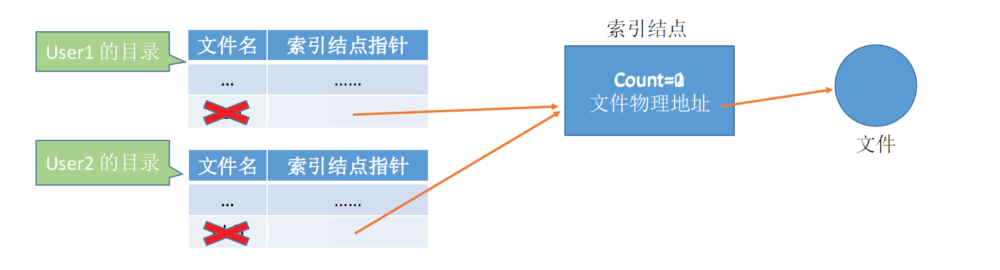

`软连接`，类似于快捷方式，记录了原文件的路径，然后层层查找。

例如文件2的内容是 C:/User1/aaa，也就是要去User1中寻找aaa的文件名对应的索引结点。

### 4.6 文件保护

文件保护有三种方式口令、加密、访问控制

1. 口令

为文件设置一串口令，就像打开手机需要先解锁。

2. 加密

使用加密方法对文件加密，只有拥有正确的解密方法才能解密，有点像不同军队之间进行通信，要实现进行加密，要是想窥探敌情，就要对密文进行破解。

3. 访问控制

每个文件的FCB或者索引结点中设置访问控制表，如windows中，设置了很多的访问权限，例如

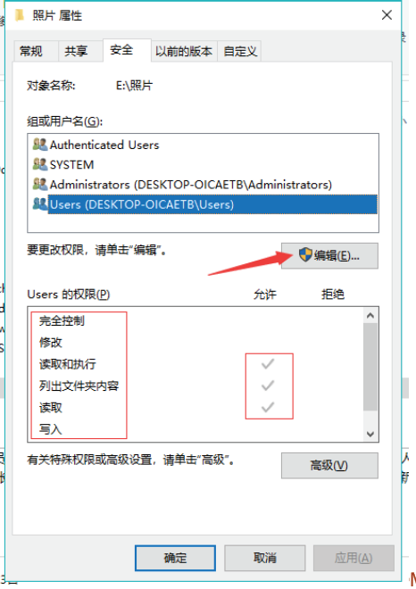

### 4.7 I/O设备

I/O就是输入输出，I/O设备就是可以将数据输入到计算机或将计算机数据输出的设备，`常见的`：鼠标、键盘、音响、显示器、打印机、话筒、摄像头等等。

I/O控制器:CPU无法直接控制I/O设备，需要一个电子部件去充当中间人，这个部件就是I/O控制器，CPU控制I/O控制器，I/O控制器控制I/O设备。

> 假如我们的CPU能够控制I/O设备，那不同的厂商、不同型号的设备，都要对应进行编码，显然是不切实际的，所以CPU要采用通用调度方式调度I/O设备从而需要I/O控制器。

**I/O控制器的组成**

以下作为了解。

>  例如我们在Java语言中，调用System.out.Println()，这本身并不能在显示器上打印，而需要通过操作系统调用write方法，接着调用字符设备接口，命令显示器写。

