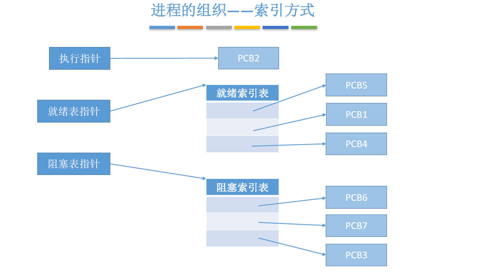
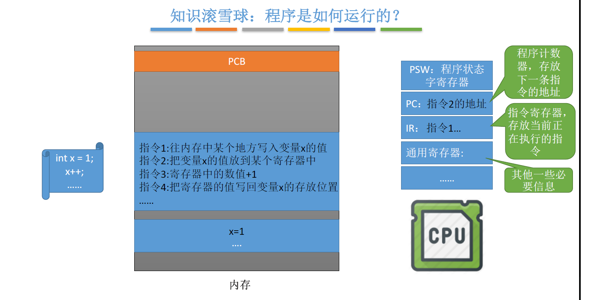
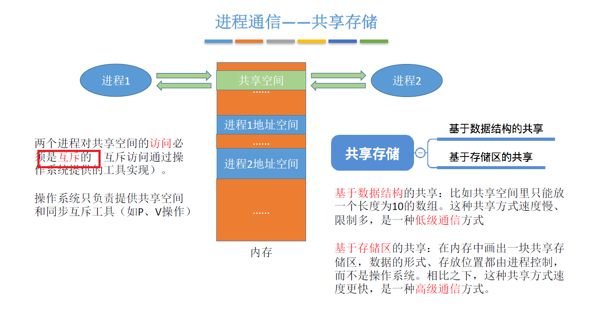
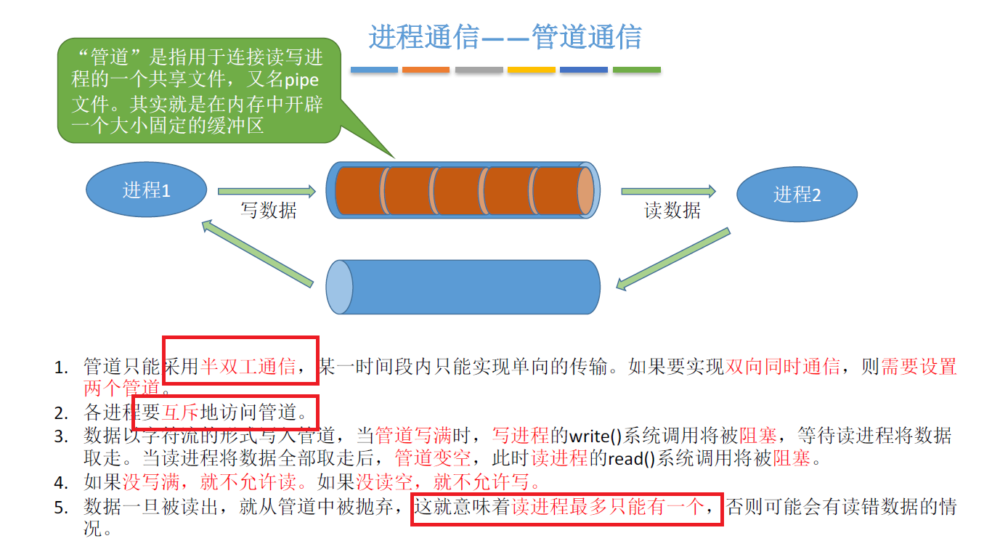
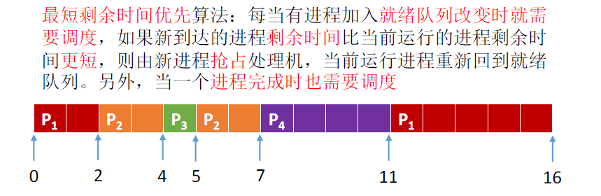
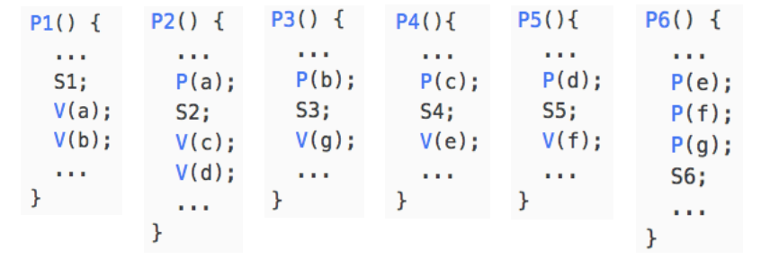
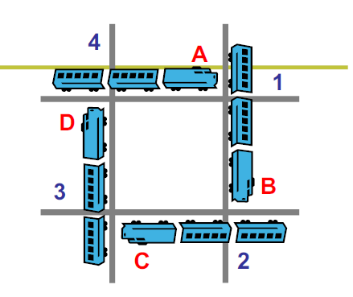

#  二、进程、线程

在进程、线程这一章节除了会讲进程、线程的概念，也会穿插，并发，锁。

### 2.1 进程

  进程由PCB(进程控制块)组成,包含了PID、资源分配情况、进程运行情况。

对用户而言，我们能看到**一个个PID**，而对操作系统而言，底层需要处理的是**一个个PCB**。

下图是通过任务管理器的用户视角下的进程。

#### 2.1.1 进程控制 

进程控制相关的原语：`创建、终止、阻塞、唤醒、切换`。也就是说我们通过原语进行进程控制，原语的执行具有原子性，不允许被中断，原语的实现可以通过“关中断指令”和“开中断指令”实现。

进程状态：`运行态，就绪态，阻塞态`

下图为进程控制的流程图。

#### 2.1.2 进程的组织形式

>  在一个系统中，通常有数十、数百乃至数千个PCB。为了能对他们加以有效的管理，应该用适当的方式把这些PCB组织起来。

进程的组织形式分为两种：链接式和索引式

根据进程状态的不同，创建不同的索引表，可以通过指针可以通过索引表指到个PCB。

#### **2.1.3 程序的执行**

> 相较于程序，进程是动态的而程序是静态的

#### 2.1.4 进程通信

> 进程通信是指进程之间的信息交换。进程是分配系统资源的单位，因此各个进程拥有的内存地址相互独立，为了保证安全，一个进程不能直接访问另一个进程的地址空间，为了实现进程通信，操作系统提供了以下方法

进程通信方法：`共享存储、消息传递、管道通信`

**共享存储**

**消息传递**

通过原语控制，进程1发送消息到消息缓冲队列或者信箱中，进程2从消息队列或者信箱中接收消息。

**管道通信**

### 2.2 线程

> 进程是资源分配的基本单位，线程是调度的基本单位，往往一个进程包含多个线程。线程并发，系统开销小，不需要切换系统资源。

线程可以分为用户级线程和内核级线程，早期如Unix只支持进程，不支持线程，所以当时的线程是由"线程库"实现的，用户将进程分为多个线程，放入线程库，但操作系统仍然是按照进程进行处理的。

这种用户级线程是由程序负责管理的，包括进行切换。这种切换方式**开销小，效率高**，但下图当一个用户级线程被阻塞后，整个**进程都将会被阻塞**。

**多线程模型**

内核级线程是由操作系统完成调度的。

将n个用户级线程映射到m个内核级线程上（ n >= m），优点是克服了多对一模型并发度不高的缺点，又克服了一对一模型中一个用户进程占用太多内
核级线程，开销太大的缺点。

### 2.3 进程调度

#### 2.3.1 三种调度方式

> 调度的产生是因为系统资源有限，没办法同时处理所有进程，需要特定的规则分配执行顺序，从而有了调度

操作系统调度层次分为三类：高级调度、中级调度、低级调度。

高级调度：从外存的后备作业中挑选一个(多个)，建立相应的PCB，获得竞争处理的权力。

后面会讲到的虚拟内存技术出现后，为了提高系统的利用率和吞吐量，会将暂时等待的进程挂起到外存。

中级调度：能够决定哪个被挂起的进程重新回到内存中。

低级调度:从就绪队列中选取一个进程，使其能够被CPU处理。

三种调度方式的频率从低到高。

> 进程调度时机：当前运行进程主动放弃(进程中止、异常、主动请求阻塞)，被动放弃(时间片用完、更高优先级的进程进入就绪队列等)

#### 2.3.2 调度算法评价指标

>  作为开发人员的话，大致了解以下即可，毕竟工作中几乎不会涉及到具体指标计算

`CPU利用率` = 忙碌的时间/总时间

`系统吞吐量` = 总共完成了多少道作业/总共花了多少时间  (简单理解就是一个完成作业的速度指标)

`周转时间 `= 作业完成时间– 作业提交时间

`平均周转时间` = 各作业周转时间之和/作业数

`带权周转时间` = (作业完成时间– 作业提交时间)/作业实际运行的时间,这项指标一定是大于等于1的，越接近一则越好

`平均带权周转时间` = 各作业带权周转时间之和/作业数

`等待时间`，指进程/作业处于等待处理机状态时间之和

`响应时间`，指从用户提交请求到首次产生响应所用的时间。例如键盘事件响应时间，鼠标点击响应时间

#### 2.3.3 【重点】调度算法

`先来先服务FCFS`：顾名思义，先来的进程先服务，主要从“公平”的角度考虑（类似于我们生活中排队买东西的例子）,非抢占式算法。

`短作业优先SJF`：最短的作业/进程优先得到服务，追求最少的平均等待时间，非抢占式算法。

`最短剩余时间优先算法SRTN`：每当有进程加入就绪队列改变时就需要调度，如果新到达的进程剩余时间比当前运行的进程剩余时间更短，则由新进程抢占处理机，当前运行进程重新回到就绪队列。是一种抢占式算法。

> 根据图示要区分最短剩余时间优先算法和短作业优先算法。

`高响应比优先HRRN`，相应比 = （等待时间+要求服务时间）/要求服务时间

，是一种非抢占式的调度算法，只有当前运行的进程主动放弃CPU时（正常/异常完成，或主动阻塞），才需要进行调度。

以上方法适用于早期的批到处理系统，适用于交互式系统的调度算法。

适用于目前交互式系统的调度算法，在交互式操作系统中，可以将任务划分为前台任务(鼠标、键盘等任务)和后台任务，前台任务更关心响应事件，后台任务更关心周转。

`时间片轮转调度算法RR`：周期性切换PCB，各个PCB轮流使用CPU

`最高优先级调度算法`即前台进程优先级高于后台进程，系统进程优先级会高于用户进程，特点就是不公平，容易产生饥饿。

>1973年关闭的MIT的IBM 7094时，发现有一个进程在1967年提交但一直未运行

### 2.4 实现进程互斥、同步、前驱

如果要清晰讲述需要了解代码逻辑，对于非专业人员来说，必要性不大，这里就不详细罗列代码了。

#### 2.4.1 硬件实现进程互斥

进程互斥：当一个进程进入临界区后，另一个进程必须等待。

硬件能够实现进程互斥，有三种方式：**利用“开/关中断指令”实现**、**TSL指令**、**SWAP指令**。

#### 2.4.2 信号量机制实现互斥、同步、前驱

信号量机制：用户进程可以通过使用操作系统提供的原语对信号量进行操作，从而很方便的实现进程的互斥、同步、前驱。

>  不要一头钻到代码里，要注意理解信号量背后的含义，一个信号量对应一种资源
>  信，在操作系统中，信号量在源码中其实就对应着一个变量，代表着某种资源的数量，通过信号量可以实现进程互斥、同步、前驱。

进程同步的理解：`要让各并发进程按要求有序地推进`。若PCB2 的“代码4”要基于PCB1 的“代码1”和“代码2”的运行结果才能执行，那么我们就必须保证“代码4”一定是在“代码2”之后才会执行。

前驱的理解：其实每一对前驱关系都是一个进程同步问题（需要保证一前一后的操作）

信号量保护：共享数据在没有保护的情况下，会出现安全问题，所以需要锁来进行保护，锁本质也是一个变量，用来保护信号量安全，那锁本身的安全谁来保护？我们不能在这里套娃对不对，所以锁是一种硬件原子指令，当要进入临界区时，上锁，离开临界区时解锁。下面的知识有一些扩展了。

> 在cpu芯片上有一个HLOCK Pin，可以通过发送指令来操作，将#HLOCK Pin电位拉低，并持续到这条指令执行完毕，从而将总线锁住，这样同一总线上的其他CPU就不能通过总线来访问内存了。最开始这些功能是用来测试cpu的，后来被操作系统实现而封装成各种功能：关键代码段，信号量等。
>
> 作者：tracy_668
> 链接：https://www.jianshu.com/p/61490effab35
> 来源：简书

### 2.5 死锁的概念与处理

`死锁的4个条件`，缺一不可

- 互斥条件：对必须互斥使用的资源的争抢才会导致死锁

- 不剥夺条件：进程所获得的资源未使用完之前，不能被其他进程强行夺走，只能主动释放。

- 请求和保持条件：进程已经保持了至少一个资源，但又提出了新的资源请求，而该资源又被其他进程占有，此时请求进程被阻塞，但又对自己有的资源保持不放。就像很窄的桥，两个人都要去对面，但谁又都无法让出位置来

- 循环等待条件：存在一种进程资源的循环等待，链中的每一个进程已获得的资源同时被下一个进程所请求。想象有一个闭环，闭环上每个人都需要下一个人手上的某个资源，那么所有人都没办法满足

  

  下图就像我们的一个死锁

  

`死锁的处理方式`：

- 死锁预防

  - 破坏互斥条件(创建一个队列，所有的请求都会被快速响应，然后队列逐渐将请求发送到处理器进行整理)

  - 破坏不剥夺条件(进程的某个资源得不到满足时，就必须立刻释放所持有的资源)

  - 破坏请求和保持条件(静态分配，进程在运行前就一次性申请全部的资源，不满足就不让允许，就像过桥时保证桥上没人才让通行，否则禁止通行)

  - 破坏循环等待条件(资源编号，进程必须按照编号递增的顺序请求资源,这样就不会出现持有大资源请求小资源的情况，也就不会有循环的等待)

    (方式较多，这里简单列举一些案例)

- 死锁避免

> 银行家算法：进程提出资源申请时，先判断这次分配会不会导致系统进入不安全状态，如果会则不答应请求，让该进程阻塞。简而言之，请求不能大于手中的资源。这种算法也叫银行家算法。

- 死锁检测与恢复

  检测方法通过死锁检测算法，下面以图的方式说明

  

  能够消除所有边，就不会发生死锁如下图

  

  不能消除所有边就会发生死锁

  

  **死锁恢复：**资源剥夺将死锁的进程挂起，释放资源；撤销进程，直接将部分或者全部死锁进程撤销；进程回退，让进程回退的足以避免死锁的地方。

- 死锁忽略

  顾名思义，忽略这个死锁，死锁概率本不高，就算出现了也只是局部的死锁，直接不管反而能提高资源利用率与整体运行的速度，也有个好听的名字叫鸵鸟算法，这样性能会提升不少，大部分操作系统也采用死锁忽略的策略。